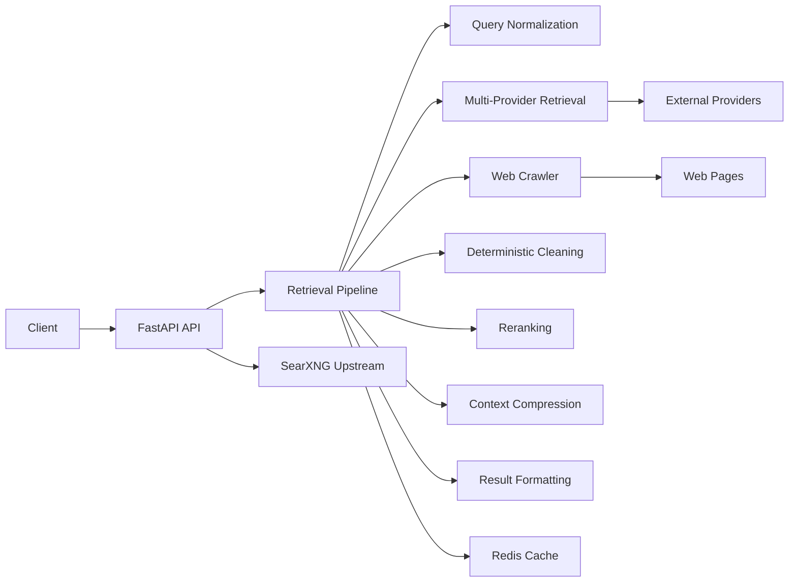

# Quarry

Quarry is an LLM-native retrieval backend. It accepts a search query, performs multi-provider retrieval, crawls web pages, deterministically cleans content, reranks documents, compresses them into token-efficient context, and returns structured results through a REST API.

## Architecture



## Quick Start

1. Copy the example environment file:

   ```bash
   cp .env.example .env
   ```

2. Install dependencies:

   ```bash
   pip install -r requirements.txt
   ```

3. Start the API:

   ```bash
   uvicorn api.app:app --reload
   ```

## Docker

Bring up the full stack with SearXNG and Redis:

```bash
docker compose up --build
```

The API reads `SEARXNG_BASE_URL` from the environment and normalizes the upstream JSON response into `SearchResponse`.

## Development Setup

- Python 3.12+
- FastAPI
- Uvicorn
- Pydantic v2
- Ruff
- Black
- Pytest
- httpx

## API

- `POST /search` accepts a `SearchRequest` body, calls SearXNG over HTTP, and returns a normalized `SearchResponse`.

## Project Layout

- `config/`: application configuration and provider definitions
- `api/`: FastAPI app, routes, schemas, and middleware
- `pipeline/`: retrieval pipeline packages
- `models/`: shared data models
- `utils/`: shared utilities
- `benchmarks/`: benchmark scaffolding
- `tests/`: test scaffolding
- `scripts/`: helper scripts
- `docs/`: project documentation
