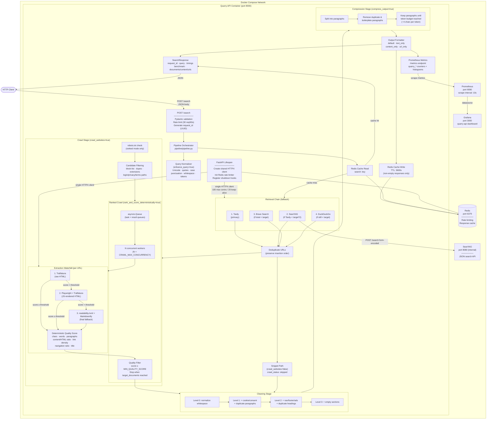

# Quarry

Quarry is an LLM-native retrieval backend. It searches a resilient multi-provider chain (Tavily → SearXNG → Brave → DuckDuckGo), optionally crawls and ranks candidate pages through a 3-stage extraction waterfall, then returns cleaned and optionally compressed Markdown through a REST API.

## System Architecture



## Quick Start

Start the complete stack (API · SearXNG · Redis · Prometheus · Grafana):

```bash
docker compose up --build
```

| Service | URL | Notes |
| --- | --- | --- |
| Quarry API | `http://localhost:8000` | `GET /health` for liveness |
| SearXNG | `http://localhost:8080` | Internal to Compose network |
| Redis | `localhost:6379` | Rate limiter + response cache |
| Prometheus | `http://localhost:9090` | Scrapes `/metrics` every 10s |
| Grafana | `http://localhost:3000` | Login: `admin` / `quarry_admin` |

## Local Development (uv)

Quarry uses [`uv`](https://github.com/astral-sh/uv) for fast, lockfile-based dependency management.

```bash
# Install all dependencies from the lockfile
uv sync

# Run the API (requires running Redis and SearXNG)
SEARXNG_BASE_URL=http://localhost:8080 \
REDIS_URL=redis://localhost:6379/0 \
uv run uvicorn api.app:app --reload
```

The app does **not** call `load_dotenv`. Export variables in your shell, use a process manager, or pass `--env-file` to Docker.

## Retrieval Chain

Quarry uses a sequential, multi-provider fallback strategy to maximise candidate coverage:

1. **Tavily** (primary) — called first on every request
2. **SearXNG** — called when Tavily returns fewer than `target_documents × 2` results
3. **Brave Search** — called when the combined total is still below `target_documents`
4. **DuckDuckGo** — ultimate free fallback when all others are insufficient

Results from all providers are concatenated and deduplicated by URL (first-seen wins).

## Single Shared HTTP Client

A single `httpx.AsyncClient` is created during FastAPI startup and shared across all outbound HTTP:

- SearXNG retrieval requests
- `robots.txt` fetches (ranked mode)
- Page crawl fetches

```
User-Agent : QuarryBot/0.6
Timeout    : 30 s
Max conns  : 100
Keep-alive : 20
```

This means the entire application maintains **one connection pool** — no TCP overhead per request, no race conditions on client lifecycle.

## Pipeline Stages

| Stage | Module | Key behaviour |
| --- | --- | --- |
| Query normalisation | `pipeline/query/normalizer.py` | Unicode, quotes, case, punctuation, whitespace, duplicate tokens |
| Retrieval | `pipeline/retrieval/` | Tavily → SearXNG → Brave → DDG fallback chain |
| Crawling | `pipeline/crawler/` | Concurrent fetch with `asyncio.Semaphore`; extractor waterfall; fallback documents |
| Ranked crawling | `pipeline/ranking/manager.py` | `asyncio.Queue`-based streaming workers; stops when `target_documents` accepted |
| Extraction quality | `pipeline/crawler/quality.py` | Weighted score across 7 signals; `MIN_SCORE = 0.68` |
| Cleaning | `pipeline/cleaning/cleaner.py` | Levels 0–3; deterministic keyword matching |
| Compression | `pipeline/compression/compressor.py` | Paragraph-level; 4 chars ≈ 1 token; optional |
| Caching | `pipeline/cache/` | Redis; `search:<sha256>`; 1-hour TTL |
| Resilience | `pipeline/resilience/` | Per-dependency retry + circuit breaker |

## Resilience

### Exponential Backoff + Jitter

Every network call is wrapped in a `RetryExecutor`. Transient exceptions (`TimeoutError`, `ConnectionError`) and HTTP status codes (408, 429, 500–504) trigger retries.

| Dependency | Max retries | Base delay | Max delay | Jitter |
| --- | ---: | ---: | ---: | ---: |
| Search providers | 3 | 250 ms | 2 s | ±200 ms |
| Page crawler | 2 | 500 ms | 4 s | ±300 ms |
| Redis | 2 | 100 ms | 1 s | ±50 ms |

### Circuit Breakers

| Breaker | Failure threshold | Recovery timeout |
| --- | ---: | ---: |
| `fast-provider` (SearXNG etc.) | 5 | 20 s |
| `slow-provider` (Playwright etc.) | 3 | 60 s |
| `crawler` | 4 | 30 s |
| `redis` | 5 | 15 s |

A breaker opens → rejects calls instantly → after timeout allows one half-open probe → closes on success or reopens on failure.

### Graceful Shutdown

`ShutdownManager` (registered in FastAPI lifespan):
1. Cancels all registered background `asyncio.Task`s
2. Runs cleanup callbacks in **reverse** registration order
3. Closes the shared HTTPX client
4. Closes the Redis client

Shutdown is idempotent — repeated signals are safely ignored.

## Middleware & Metrics

### Rate Limiting

`api/middleware/rate_limit.py` — `conditional_rate_limit`:
- Uses `fastapi-limiter` + Redis
- **30 requests / 60 seconds** per client
- Requests with header `x-benchmark: true` bypass the limiter (for the benchmark runner)

### Prometheus Metrics (`api/metrics.py`)

| Metric | Type | Description |
| --- | --- | --- |
| `quarry_search_cache_hits_total` | Counter | Responses served from Redis cache |
| `quarry_cache_lookup_ms` | Histogram | Time spent on cache reads |
| `quarry_urls_found_total` | Counter | Candidate URLs from all providers |
| `quarry_pages_crawled_total` | Counter | Pages successfully crawled |
| `quarry_crawl_failures_total` | Counter | Pages that failed to crawl |
| `quarry_compression_ratio` | Histogram | Distribution of byte-level compression ratios |
| `quarry_tokens_saved_total` | Counter | Tokens removed by compression |

FastAPI HTTP metrics (latency, status codes, request counts) are additionally exposed by `prometheus-fastapi-instrumentator` at `GET /metrics`.

## Schemas (Pydantic v2)

### `SearchRequest`

| Field | Type | Default | Description |
| --- | --- | --- | --- |
| `query` | `str` | required | Search query |
| `format` | `FlexibleFormatting` | `default` | `default` · `text_only` · `content_only` · `url_only` |
| `cleaning_level` | `CleaningLevel` (0–3) | `0` | Cleaning intensity |
| `crawl_websites` | `bool` | `false` | Fetch and extract pages |
| `enable_caching` | `bool` | `false` | Read/write Redis cache |
| `compress_output` | `bool` | `false` | Run compression after cleaning |
| `target_token_budget` | `int \| null` | `null` | Per-document token limit (default 2048) |
| `target_documents` | `int` | `10` | Stop ranked crawl after N quality docs |
| `enhance_query` | `bool` | `false` | Normalise query before retrieval |
| `rank_and_score_deterministically` | `bool` | `false` | Queue-based ranked crawling |
| `time_range` | `day\|week\|month\|year\|null` | `null` | SearXNG recency filter |
| `language` | `str \| null` | `null` | SearXNG language |
| `engines` | `list[str]` | `[]` | SearXNG engine filter |
| `categories` | `list[str]` | `[]` | SearXNG category filter |

### `SearchResponse`

```
SearchResponse
├── success: bool
├── request_id: str          # UUID per request (not per process)
├── query: str               # normalised query
├── timings: SearchTimings   # per-stage latencies (ms)
├── benchmark: SearchBenchmark
│   ├── cache_hit / cache_lookup_ms / cache_write_ms
│   ├── urls_found / crawlable_urls / urls_filtered_out
│   ├── pages_successfully_crawled / crawl_failures / average_crawl_depth
│   ├── bytes_before / bytes_after
│   ├── tokens_before / tokens_after
│   ├── compression_ratio (property)
│   └── token_reduction_ratio (property)
└── [ONE of the following, based on format]
    ├── documents: list[CleanDocument]   # format=default
    ├── formatted_content: str           # format=text_only | content_only
    └── urls: list[str]                  # format=url_only
```

`None` fields are stripped from the response by `response_model_exclude_none=True`.

## Tests

```
tests/
├── unit/
│   ├── test_cleaner.py          # Cleaning level transformations
│   ├── test_compressor.py       # Token-budget compression
│   ├── test_crawler.py          # Extraction waterfall, quality scoring, fallback docs
│   ├── test_openapi_docs.py     # OpenAPI schema generation
│   ├── test_ranking_flow.py     # Queue-based ranked crawl orchestration
│   ├── test_searxng.py          # SearXNG result normalisation
│   └── test_tokens.py           # Token estimator
├── integration/
│   └── test_search_api.py       # Full FastAPI route with monkeypatched pipeline
└── datasets/
    ├── easy_queries.txt
    ├── medium_queries.txt
    └── hard_queries.txt         # Used by the benchmark runner
```

Run all tests:

```bash
uv run pytest
```

Run with coverage:

```bash
uv run pytest --cov=api --cov=pipeline --cov=models --cov-report=term-missing
```

## Benchmark

`scripts/benchmark.py` runs three configurations against three query difficulty tiers:

| Config | Description |
| --- | --- |
| `baseline` | Crawl + rank, no cache, no compression |
| `cache_on` | Crawl + rank + cache + query normalisation |
| `compression_1048_cache_off` | Crawl + rank + compress to 1048 tokens |

Each run reports:

```json
{
  "requests": 10,
  "success_rate": 1.0,
  "avg_latency": 4231.5,
  "p50": 4100,
  "p95": 6800,
  "p99": 7200,
  "cache_hit_rate": 0.0,
  "avg_token_reduction_pct": 38.2
}
```

To bypass rate limiting during benchmarks, the runner sets `x-mode: benchmark` on each request (handled by the API's conditional limiter via the `x-benchmark: true` header pattern).

## CI / CD Pipelines

| Workflow | Trigger | Steps |
| --- | --- | --- |
| `ci.yml` | push/PR to `main` | uv install → Ruff → Black → Pytest (with Redis + SearXNG services) |
| `docker.yml` | push/PR to `main` | Build and push API Docker image |
| `codeql.yml` | push/PR to `main` | GitHub CodeQL security scan |
| `benchmark.yml` | push/PR to `main` + manual | Full benchmark suite with live Tavily + SearXNG |

The benchmark workflow validates `TAVILY_API_KEY` and runs `scripts/benchmark.py` against a live API process.

## Configuration

| Variable | Default | Description |
| --- | --- | --- |
| `SEARXNG_BASE_URL` | `http://localhost:8080` | SearXNG instance URL |
| `SEARXNG_TIMEOUT_SECONDS` | `20` | SearXNG request timeout |
| `CRAWL_TIMEOUT_SECONDS` | `15` | Per-page crawl timeout |
| `CRAWL_MAX_CONCURRENCY` | `5` | Max concurrent crawler workers |
| `REDIS_URL` | `redis://redis:6379/0` | Redis for rate limiting + cache |
| `GRAFANA_ADMIN_PASSWORD` | `quarry_admin` | Grafana admin password |
| `TAVILY_API_KEY` | — | Tavily search API key (benchmark CI secret) |

Hard-coded client defaults (not env-overridable):

| Setting | Value |
| --- | --- |
| User-Agent | `QuarryBot/0.6` |
| HTTP timeout | 30 s |
| Max connections | 100 |
| Keep-alive connections | 20 |

## Project Layout

```
quarry/
├── api/
│   ├── app.py              # FastAPI app, lifespan, Prometheus instrument
│   ├── metrics.py          # Custom prometheus_client counters + histograms
│   ├── middleware/
│   │   └── rate_limit.py   # Conditional Redis-backed rate limiter
│   └── routes/
│       └── search.py       # POST /search — pipeline call + metric emission
├── config/
│   ├── logging.py          # JSON structured logging
│   └── settings.py         # Frozen dataclass from env vars
├── models/
│   ├── document.py         # Document, Documents
│   ├── clean_document.py   # CleanDocument, CleanDocuments
│   └── search.py           # SearchRequest, SearchResponse, SearchBenchmark, SearchTimings, …
├── pipeline/
│   ├── pipeline.py         # Top-level orchestration
│   ├── cache/              # Redis get/set/make_key
│   ├── cleaning/           # cleaner.py, steps.py
│   ├── compression/        # compressor.py
│   ├── crawler/            # crawler.py, fetcher.py, manager.py, quality.py, extractors/
│   ├── http/               # Shared httpx.AsyncClient lifecycle
│   ├── query/              # Query normaliser
│   ├── ranking/            # Queue-based ranked crawl manager, filters, recall
│   ├── resilience/         # RetryPolicy, CircuitBreaker, ShutdownManager, policies
│   └── retrieval/          # searxng.py, tavily.py, brave.py, duckduckgo.py, robots.py
├── scripts/
│   └── benchmark.py        # Async benchmark runner
├── tests/
│   ├── unit/               # Component-level tests
│   ├── integration/        # FastAPI TestClient tests
│   └── datasets/           # Query difficulty tiers
├── docker/
│   └── searxng/settings.yml
├── docker-compose.yml       # API + SearXNG + Redis + Prometheus + Grafana
├── docker-compose.dev.yml
├── Dockerfile
├── prometheus.yml           # scrape_interval: 10s → api:8000
└── pyproject.toml           # uv / setuptools / ruff / black / pytest config
```

## Stage Documentation

- [Search API](docs/search-api.md) — request fields, response shape, curl example
- [Request Flow](docs/request-flow.md) — full lifecycle sequence diagram
- [Retrieval](docs/retrieval.md) — fallback chain, SearXNG parameters, normalisation
- [Crawling](docs/crawling.md) — fetch, extractor waterfall, quality scoring, ranked mode
- [Cleaning](docs/cleaning.md) — level-to-step mapping
- [Compression](docs/compression.md) — paragraph budget algorithm
- [Caching](docs/caching.md) — Redis key construction, TTL, circuit breaker
- [Resilience & Observability](docs/resilience-observability.md) — retry policies, circuit breakers, shutdown, metrics
- [Testing](docs/testing.md) — unit/integration test structure, coverage, CI config
- [Benchmark](docs/benchmark.md) — benchmark script, configurations, CI workflow, result interpretation
