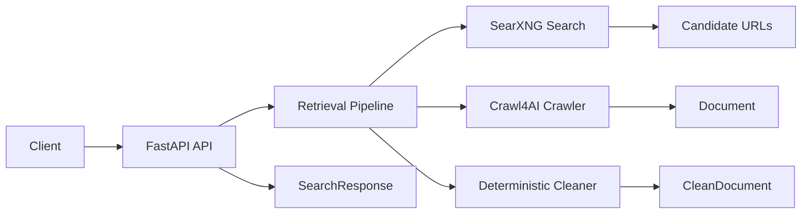

# Quarry

Quarry is an LLM-native retrieval backend. It accepts a search query, retrieves candidate URLs via SearXNG, fetches and parses the matching pages over HTTP, deterministically cleans the markdown, and returns structured results through a REST API.

## Architecture



## Quick Start

Start the complete development stack, including SearXNG and Redis:

```bash
docker compose up --build
```

The API is available at `http://localhost:8000`; its health endpoint is
`GET /health`. SearXNG is exposed at `http://localhost:8080`, and Redis at
`localhost:6379`.

Use `docker compose`, not the API image alone, for a plug-and-play start. The
Dockerfile builds only the API container; Compose provides the required SearXNG
and Redis services.

## Local Development

Quarry requires reachable SearXNG and Redis instances. Install the project with
your preferred Python package manager, then run the application with connection
settings appropriate for services running on your host:

```bash
uv sync
SEARXNG_BASE_URL=http://localhost:8080 \
REDIS_URL=redis://localhost:6379/0 \
uv run uvicorn api.app:app --reload
```

The application does not load a `.env` file automatically. Export variables in
your shell, configure them in your process manager, or pass an environment file
to the command that starts the app.

## Configuration

| Variable | Default | Purpose |
| --- | --- | --- |
| `SEARXNG_BASE_URL` | `http://searxng:8080` | URL of the SearXNG service. |
| `SEARXNG_TIMEOUT_SECONDS` | `20` | Timeout for SearXNG requests. |
| `CRAWL_TIMEOUT_SECONDS` | `30` | Timeout for crawling a page. |
| `CRAWL_MAX_CONCURRENCY` | `4` | Maximum number of concurrent crawls. |
| `REDIS_URL` | `redis://redis:6379/0` | Redis connection URL used for response caching. |

The defaults use Docker Compose service names. Override `SEARXNG_BASE_URL` and
`REDIS_URL` when running the API outside that Compose network.

Redis clients are created lazily when caching is used and are closed during API
shutdown. Cached search responses expire after one hour.

`POST /search` returns:

- `query`
- `timings`
- `documents`

Each document is a `CleanDocument` that preserves the raw document fields and adds deterministic cleaning metrics.

## Development Setup

- Python 3.12+
- FastAPI
- Uvicorn
- Pydantic v2
- Ruff
- Black
- Pytest
- httpx
- BeautifulSoup4

## API

- `POST /search` accepts a `SearchRequest` body, calls SearXNG over HTTP, crawls the returned URLs, cleans the markdown, and returns a normalized `SearchResponse`.

See [the Search API reference](docs/search-api.md) for request fields and an
example.

## Pipeline Documentation

The processing pipeline is documented stage by stage:

- [Retrieval](docs/retrieval.md): SearXNG request construction and result normalization.
- [Crawling](docs/crawling.md): page fetching, HTML-to-Markdown conversion, and fallbacks.
- [Cleaning](docs/cleaning.md): deterministic Markdown transformations and metrics.
- [Caching](docs/caching.md): Redis lifecycle, key construction, and expiration.

## Project Layout

- `config/`: application configuration and provider definitions
- `api/`: FastAPI app, routes, schemas, and middleware
- `pipeline/`: retrieval pipeline packages
- `models/`: shared data models
- `utils/`: shared utilities
- `benchmarks/`: benchmark scaffolding
- `tests/`: test scaffolding
- `scripts/`: helper scripts
- `docs/`: project documentation
