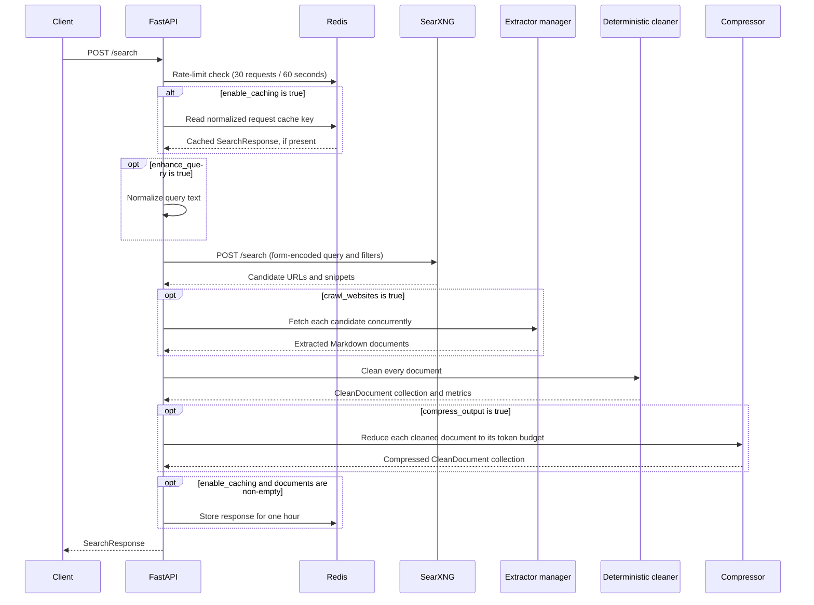

# Request Flow

This guide describes what happens from a client request to the final response.
The flow is implemented by `api/app.py`, `api/routes/search.py`, and
`pipeline/pipeline.py`.

## 1. Application Startup

FastAPI runs its lifespan hook before accepting requests. It creates the shared
asynchronous Redis client from `REDIS_URL` and gives it to `fastapi-limiter`.
The client is closed on shutdown. Redis must therefore be reachable even when
response caching is disabled, because the `/search` rate limit depends on it.

## 2. API Validation and Rate Limiting

`POST /search` validates its JSON body as `SearchRequest`. The `query` field is
required. Before the endpoint runs, the Redis-backed limiter allows at most 30
requests in a 60-second window. A request over that limit is rejected by the
limiter.

## 3. Optional Response Cache

When `enable_caching` is `true`, the pipeline builds a `search:<sha256>` key.
It excludes `enable_caching` and `format`, normalizes query whitespace and
case, and sorts engine/category filters. A cache hit returns the stored
`SearchResponse` immediately; SearXNG, crawling, and cleaning do not run.

Only completed responses with at least one document are cached. Entries use a
one-hour TTL. See [Caching](caching.md) for the full key rules.

## 4. Retrieval

On a cache miss (or when caching is disabled), Quarry sends a form-encoded
request to SearXNG. The query and optional category, language, time-range, and
engine filters are passed through. Quarry always requests SearXNG JSON and
normalizes each result into `url`, `title`, `content`, and provider metadata.

When `enhance_query` is true, a deterministic normalizer first applies Unicode,
quote, case, punctuation, whitespace, and consecutive-token normalization. The
normalized query is the query sent to SearXNG and returned in the response.

If retrieval fails, the pipeline stops and returns an empty `SearchResponse`.
Its search and total timings are retained; crawl and cleaning timings are zero.

## 5. Crawling and Extraction

With `crawl_websites: false` (the default), no URL is fetched. Each SearXNG
snippet becomes a `Document` with `crawl_status: "skipped"`.

With `crawl_websites: true`, each result is fetched with HTTPX using the
configured timeout. A semaphore limits concurrent fetches. The extractor
manager tries these extractors in order, stopping when its deterministic quality
threshold passes:

1. Trafilatura on the HTTP response HTML.
2. Playwright renders JavaScript, then Trafilatura extracts the rendered HTML.
3. readability-lxml isolates article HTML and Markdownify renders Markdown.

Quality uses title presence, content length, word and paragraph counts,
content-to-HTML ratio, link density, and navigation ratio. If all extractors
run without reaching the threshold, the highest-scoring output is used. A fetch
or extraction exception instead produces a fallback document that retains the
SearXNG snippet and records the reason in metadata.

When both `rank_and_score_deterministically` and `crawl_websites` are true,
candidate URLs are filtered, crawled in recall batches, scored by extraction
quality, and returned in descending quality order up to `target_documents`.

## 6. Cleaning and Metrics

Every document is converted to a `CleanDocument`. Level `0` normalizes
whitespace; levels `1` through `3` progressively remove cookie banners,
duplicates, navigation/footer/advertisement blocks, duplicate headings, and
empty sections. Quarry records original and cleaned token counts, reduction
percentage, elapsed cleaning time, and the named steps that ran.

See [Cleaning](cleaning.md) for the precise level-to-step mapping.

## 7. Optional Compression

When `compress_output` is true, Quarry runs deterministic compression after
cleaning. It removes duplicate and low-information paragraphs, then keeps
paragraphs until the per-document token budget is reached. The request's
`target_token_budget` is used when present; otherwise the default is 2,048.
Each compressed document receives the `deterministic_compression` step marker.
If compression fails, Quarry returns the cleaned documents instead.

See [Compression](compression.md) for details.

## 8. Response, Timings, and Errors

The response contains the original query, separate search/crawl/cleaning/total
latencies, optional compression latency, and cleaned documents. The total is
measured after the optional compression stage. A failure in retrieval, crawling,
or cleaning stops later stages and returns an empty document list with timings
for the work that completed; compression latency is then `0.0`. If compression
itself fails, Quarry returns uncompressed cleaned documents and records the
failed compression attempt's latency. The route also catches unexpected
exceptions and returns an empty response with all timings set to zero.

## Configuration

The application reads only these environment variables at startup:

| Variable | Default | Used by |
| --- | --- | --- |
| `SEARXNG_BASE_URL` | `http://searxng:8080` | Retrieval client |
| `SEARXNG_TIMEOUT_SECONDS` | `20` | Retrieval timeout |
| `CRAWL_TIMEOUT_SECONDS` | `30` | HTTP crawling timeout |
| `CRAWL_MAX_CONCURRENCY` | `4` | Crawl semaphore |
| `REDIS_URL` | `redis://redis:6379/0` | Rate limiter and cache |

Quarry does not call `load_dotenv`, so there is intentionally no `.env.example`.
For local runs, export the variables or use your process runner's environment
file option. Docker Compose supplies the service-network defaults directly.
