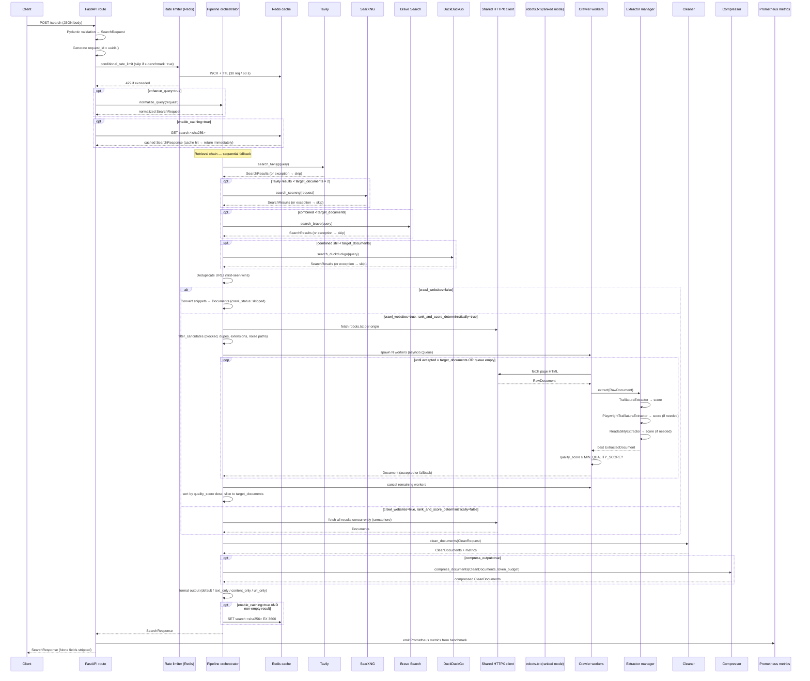

# Request Flow

Complete lifecycle of a `POST /search` request. Implemented in `api/app.py`,
`api/routes/search.py`, and `pipeline/pipeline.py`.



## 1. Application Startup

FastAPI runs its lifespan context before accepting any requests:

1. `create_http_client()` — creates one `httpx.AsyncClient` (100 connections,
   20 keep-alive, 30 s timeout, `QuarryBot/0.6` user agent).
2. `get_redis()` + `FastAPILimiter.init(redis)` — initialises the rate limiter.
3. `shutdown_manager.register_cleanup(close_http_client)` and `register_cleanup(close_redis)`.

## 2. Rate Limiting

`conditional_rate_limit` in `api/middleware/rate_limit.py`:

- 30 requests per 60 seconds per client (Redis-backed via `fastapi-limiter`).
- Requests with header `x-benchmark: true` bypass the limiter entirely. This
  allows `scripts/benchmark.py` to run without exhausting quotas.

HTTP `429` is returned when the limit is exceeded.

## 3. Request ID

A fresh `uuid4()` is generated **inside the route handler** for every request.
This guarantees uniqueness across concurrent requests and worker processes.

## 4. Optional Query Normalisation

When `enhance_query=true`, `normalize_query(request)` applies deterministic
transformations before anything hits the network:

- Unicode NFKC normalisation
- Curly-quote and dash normalisation
- Lowercase
- Punctuation stripping
- Whitespace collapse
- Consecutive duplicate token removal

## 5. Cache Read

When `enable_caching=true`, the pipeline builds `search:<sha256>` (excluding
`enable_caching`, normalising the query, sorting lists) and issues a Redis `GET`.
A hit returns the stored `SearchResponse` immediately — retrieval, crawling,
cleaning, and compression are skipped entirely.

## 6. Retrieval Chain

Quarry runs providers sequentially, each guarded by its own try/except:

| Step | Provider | Trigger condition |
| --- | --- | --- |
| 1 | Tavily | Always |
| 2 | SearXNG | Tavily results < `target_documents × 2` |
| 3 | Brave | Combined total < `target_documents` |
| 4 | DuckDuckGo | Combined total still < `target_documents` |

Results are concatenated and deduplicated (URL, first-seen wins). If all
providers fail or the combined total is zero, the pipeline returns an empty
`SearchResponse` with the measured search latency.

## 7. Crawling and Extraction

### Snippet path (`crawl_websites=false`)

Each `SearchResult` becomes a `Document` with `crawl_status: "skipped"` and
no network calls are made.

### Standard crawl (`crawl_websites=true`, `rank_and_score_deterministically=false`)

All results are fetched concurrently, bounded by `asyncio.Semaphore(CRAWL_MAX_CONCURRENCY)`.
Fetch or extraction failures produce fallback documents preserving the snippet.

### Ranked crawl (`crawl_websites=true`, `rank_and_score_deterministically=true`)

Pre-crawl: robots.txt check → candidate filter.  
During crawl: `asyncio.Queue`-based worker pool streams results as they complete.
The orchestrator accepts documents with `quality_score ≥ MIN_QUALITY_SCORE` and
cancels all workers the moment `target_documents` are accepted.

## 8. Cleaning

`clean_documents` converts every `Document` to a `CleanDocument` at the
requested `cleaning_level` (0–3). Metrics (token counts, reduction %, latency,
applied steps) are recorded per document.

## 9. Compression (optional)

When `compress_output=true`, the compressor runs paragraph-level deduplication
and budget trimming on each `CleanDocument`. `target_token_budget` (default 2048)
controls the per-document limit (estimated at 4 chars/token).

## 10. Output Formatting

The pipeline selects exactly one payload field based on `format`:

| `format` | Populated field | Content |
| --- | --- | --- |
| `default` | `documents` | `list[CleanDocument]` |
| `text_only` | `formatted_content` | Title + URL + markdown per doc, joined by `---` |
| `content_only` | `formatted_content` | Markdown only, joined by blank lines |
| `url_only` | `urls` | `list[str]` of document URLs |

`response_model_exclude_none=True` strips the two unpopulated fields from the
JSON response automatically.

## 11. Cache Write

When `enable_caching=true` and the response contains non-empty content, the
`SearchResponse` is serialised and stored at `search:<sha256>` with a 3600-second TTL.

## 12. Prometheus Emission

After the pipeline completes, the route handler emits metrics from
`response.benchmark`:

```python
if benchmark.cache_hit:         SEARCH_CACHE_HITS.inc()
URLS_FOUND.inc(benchmark.urls_found)
PAGES_CRAWLED.inc(benchmark.pages_successfully_crawled)
CRAWL_FAILURES.inc(benchmark.crawl_failures)
TOKENS_SAVED.inc(benchmark.tokens_before - benchmark.tokens_after)
CACHE_LOOKUP_MS.observe(benchmark.cache_lookup_ms)
COMPRESSION_RATIO.observe(benchmark.compression_ratio)
```

## Error Handling

| Failure | Behaviour |
| --- | --- |
| Retrieval total = 0 | Return empty `SearchResponse`; `success=false` |
| Crawl stage exception | Return empty response with search + crawl timings |
| Cleaning stage exception | Return empty response with search + crawl + cleaning timings |
| Compression exception | Return **uncompressed** cleaned documents; log the error |
| Unhandled route exception | Return empty response with `total_request_latency_ms` only |
